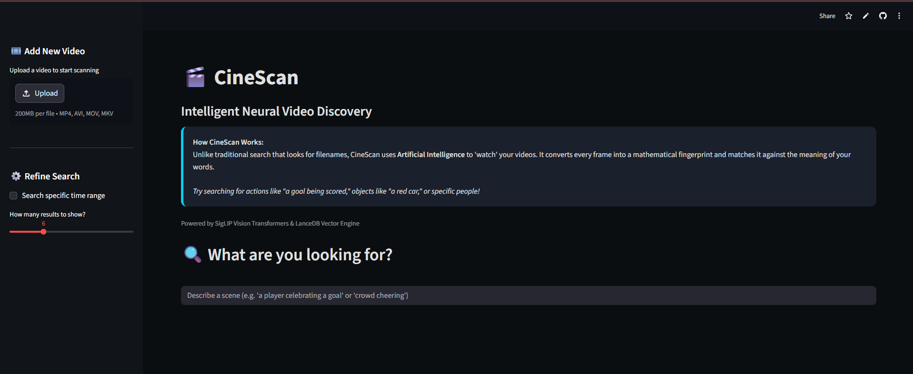
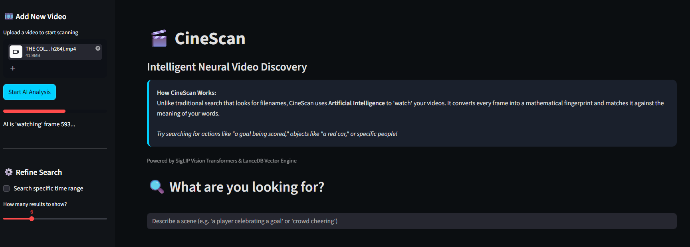
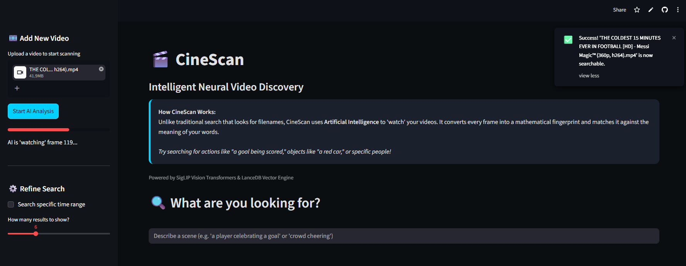
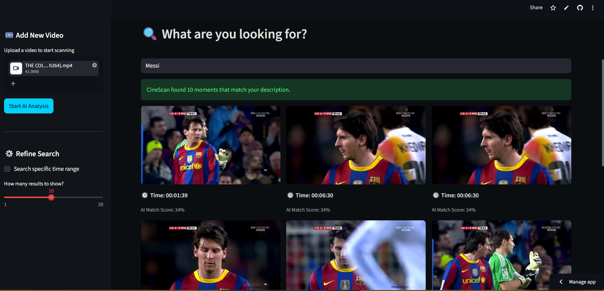
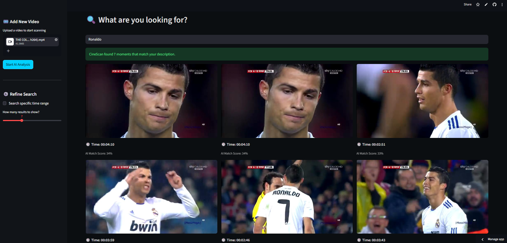

# 🎬 CineScan-AI: Intelligent Neural Video Discovery

[](https://cinescan-ai.streamlit.app/)
[](https://www.python.org/downloads/release/python-3110/)
[](https://github.com/Cyphershadow24ar/CineScan-AI)

**Live Demo:** [cinescan-ai.streamlit.app](https://cinescan-ai.streamlit.app/)

**CineScan-AI** is a next-generation video search engine that uses Vision Transformers (ViT) to "understand" video content semantically. Unlike traditional video search that relies on filenames or manual tags, CineScan-AI allows users to search for specific moments using natural language descriptions (e.g., *"A player dribbling past defenders"* or *"Fans cheering in the stadium"*).

---

## 🚀 Business Model & Value Proposition

In the modern digital era, video data is exploding. Media houses, sports broadcasters, and security firms struggle to manually index thousands of hours of footage. 

**CineScan-AI solves this by:**
* **Automated Asset Tagging:** Replaces manual logging with high-speed AI indexing.
* **Semantic Retrieval:** Bridges the gap between text and vision using **SigLIP (Sigmoid Language-Image Pre-training)**.
* **Optimized Storage:** Uses **LanceDB**, a serverless vector engine, for efficient similarity search without heavy infrastructure.

---

## 📸 How It Works (Step-by-Step)

### Step 1: Upload Your Media
Drag and drop video files (MP4, MOV, AVI) into the dashboard.


### Step 2: AI Neural Analysis
The system extracts frames and converts them into mathematical "embeddings" representing the visual context.


### Step 3: Success Notification
The app confirms when the neural indexing is complete and searchable.


### Step 4: Semantic Search (Messi)
The AI identifies specific players and actions based on natural language queries.


### Step 5: Multi-Subject Discovery (Ronaldo)
Query the same video for different subjects; the AI understands the shift in context.


---

## ⚠️ Cloud vs. Local Deployment

To ensure stability on the **Streamlit Cloud (Free Tier)**, the following optimizations are applied:
* **Frame Sampling:** Reduced to **0.2 FPS** (1 frame every 5 seconds) to manage memory.
* **Batch Processing:** Processing is limited to **4 frames per batch** to stay within the 1GB RAM limit.
* **Performance:** Local execution on a GPU-enabled machine will provide significantly faster indexing and higher frame-rate analysis.

---

## 🛠️ Local Setup Instructions

1.  **Clone the Repository:**
    ```bash
    git clone [https://github.com/Cyphershadow24ar/CineScan-AI.git](https://github.com/Cyphershadow24ar/CineScan-AI.git)
    cd CineScan-AI
    ```
2.  **Install Requirements:**
    ```bash
    pip install -r requirements.txt
    ```
3.  **Run Locally:**
    ```bash
    streamlit run app.py
    ```

---

## 🧪 Tech Stack
* **Language:** Python 3.11
* **AI Model:** Google SigLIP (Vision-Language Transformer)
* **Vector DB:** LanceDB
* **Frontend:** Streamlit
* **Processing:** OpenCV, PyTorch, SentencePiece